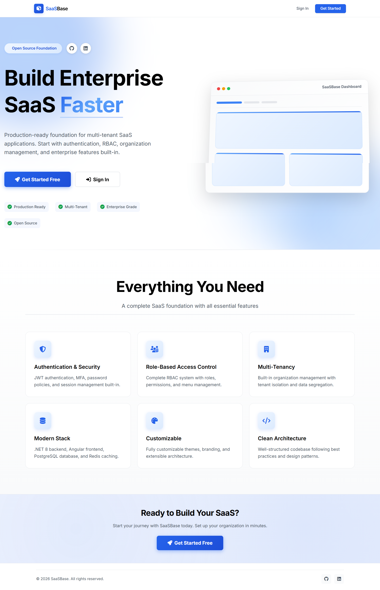
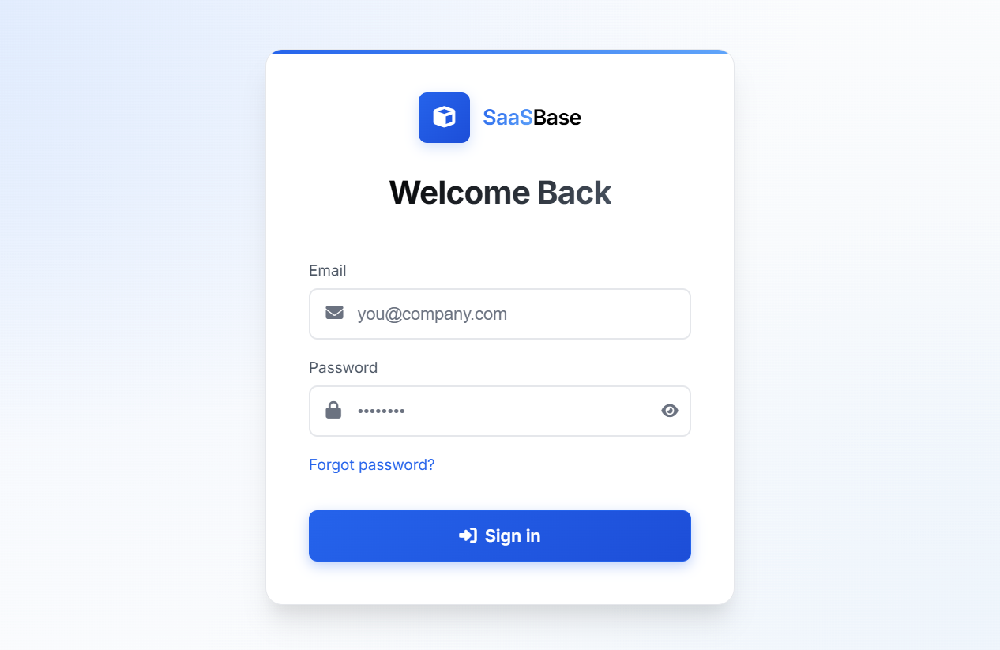
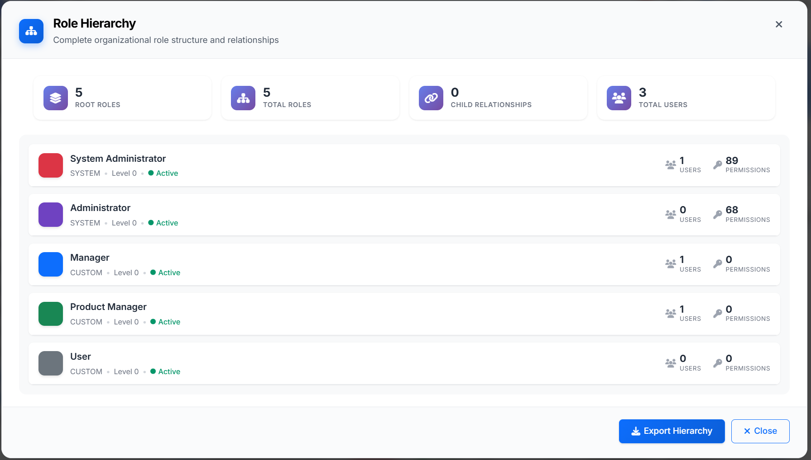
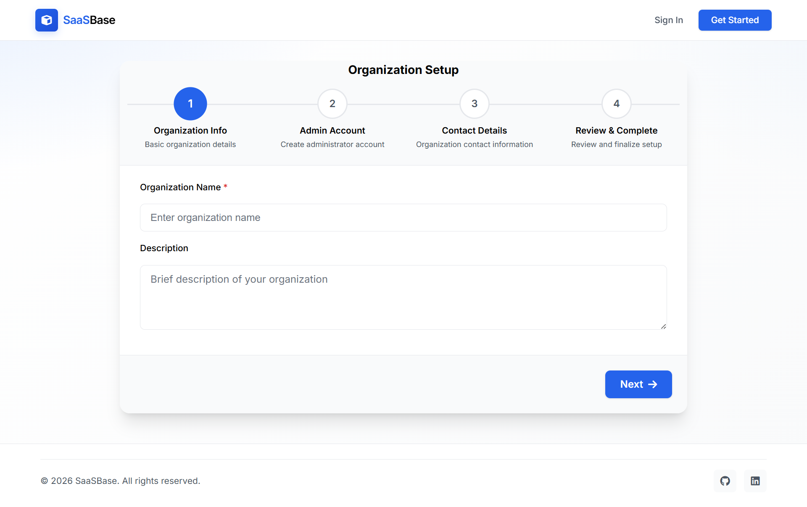
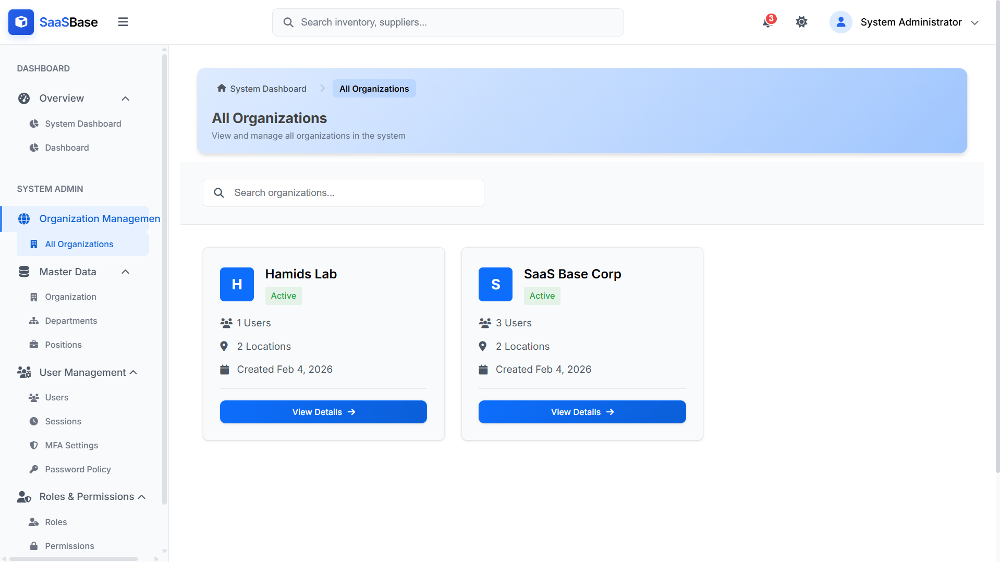
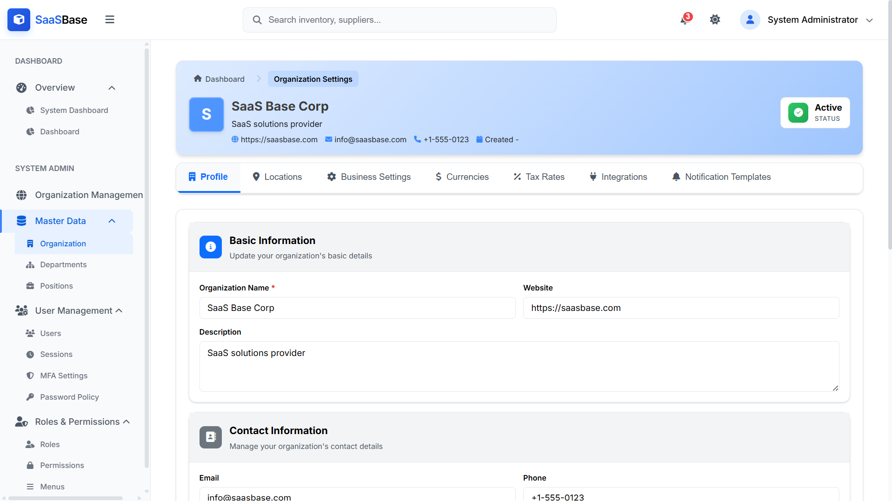
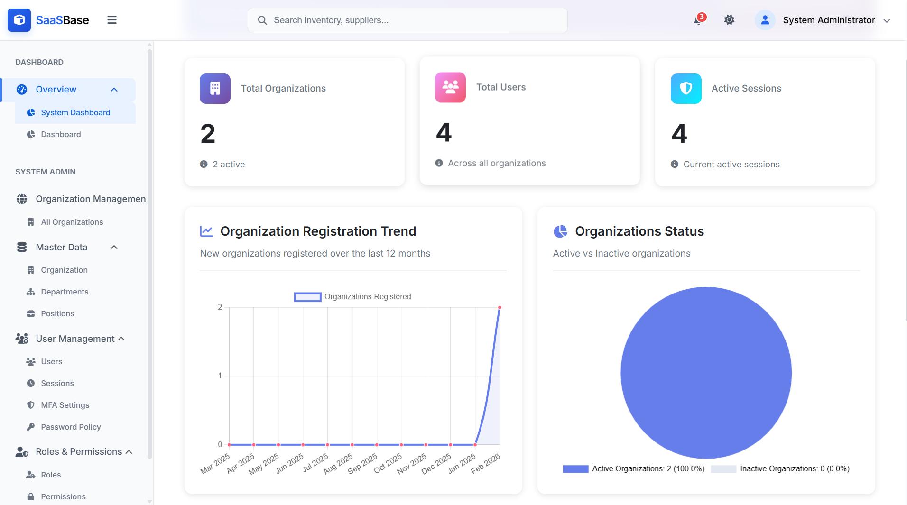
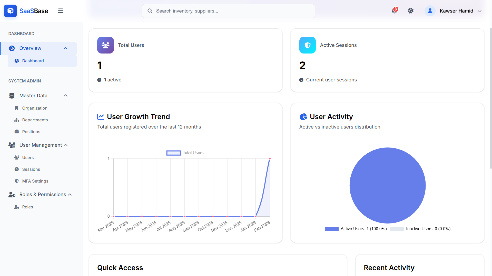
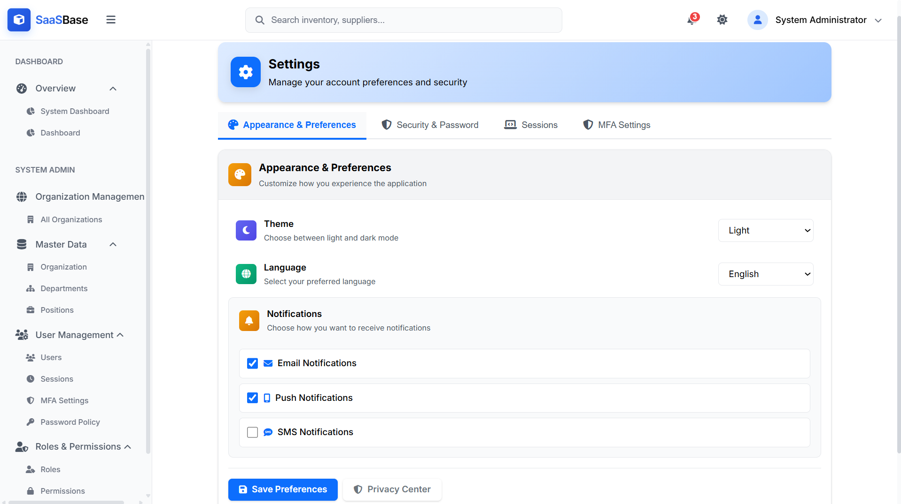

# SaaSBase

<div align="center">

**🚀 Production-Ready Open-Source Foundation for Multi-Tenant SaaS Applications**

[](https://opensource.org/licenses/MIT)
[](https://dotnet.microsoft.com/)
[](https://angular.io/)
[](https://www.postgresql.org/)

</div>

## 🎯 What is SaaSBase?

**SaaSBase** is an **open-source foundation application** designed for building **large-scale, enterprise-grade, multi-tenant SaaS applications**. It is **not industry-specific** - anyone can use it as a foundation for their SaaS application, regardless of their business domain.



### Why SaaSBase?

- ✅ **Complete Foundation**: Start with a production-ready base instead of building from scratch
- ✅ **Multi-Tenant Ready**: Built-in organization management and tenant isolation
- ✅ **Enterprise-Grade**: Designed for large-scale, production deployments
- ✅ **Industry Agnostic**: Use it for any business domain - healthcare, e-commerce, education, or any SaaS idea
- ✅ **Open Source**: Free to use, modify, and distribute under MIT License
- ✅ **Production Ready**: Includes security, scalability, and best practices out of the box

### Perfect For

- 🏢 **Startups** building their first SaaS product
- 🏭 **Enterprises** needing a solid foundation for internal tools
- 👨‍💻 **Developers** who want to focus on business logic, not infrastructure
- 🚀 **Teams** launching multi-tenant SaaS applications quickly

## Overview

SaaSBase provides a complete, production-grade foundation with enterprise features pre-built, allowing you to focus on your unique business logic. It includes:

## Features

### Backend: .NET 7.0 Web API
- Clean architecture with separation of concerns
- Entity Framework Core for database operations
- PostgreSQL support by default (easily switchable to other databases)
- RESTful API design
- API versioning support
- Swagger/OpenAPI documentation

### Frontend: Angular
- Fully integrated with authentication and authorization
- Role-based UI components
- Modern, responsive design
- Standalone components architecture

.png)

.png)

### Database: ORM-based (EF Core)
- PostgreSQL by default
- Easily switchable to other databases (SQL Server, MySQL, etc.)
- Migration support
- Seed data for initial setup

### Authentication & Authorization
- **Role-Based Access Control (RBAC)** fully implemented
- JWT token authentication
- Admin, Manager, User roles ready
- Permission management for granular access
- Multi-factor authentication (MFA) support
- Password policy enforcement
- Session management






### Caching & Performance
- Redis integrated for caching frequently accessed data
- Response caching support
- Performance monitoring

### Multi-Tenant Management (Core Feature)
- **Complete multi-tenant architecture** built from the ground up
- **Organization-based tenant isolation** at the data level
- **Tenant context management** throughout the application
- **Scalable tenant management** for large-scale deployments
- **Organization hierarchy** support (departments, locations, positions)
- **Tenant-specific configurations** and settings







### Initial Organization Setup
- Default admin user & role seeded
- Organizational hierarchy support
- Configurable team / department structure
- Location management
- Position management

### Audit & Logging
- Centralized logging with Serilog
- Action auditing for sensitive operations
- User activity tracking
- Audit trail support

### Extensible & Modular
- Service layer separation
- Dependency injection throughout
- Modular folder structure for scaling large projects
- Clean architecture principles
- Repository pattern
- Unit of Work pattern

### Additional Features
- Menu management for dynamic navigation
- File upload and management
- Import/Export functionality
- Email service integration (SendGrid)
- SMS service support
- Notification templates







## Technology Stack

### Backend (.NET)
- **Framework**: .NET 7.0
- **ORM**: Entity Framework Core
- **Database**: PostgreSQL (default), easily switchable
- **Authentication**: JWT tokens
- **API Documentation**: Swagger/OpenAPI
- **Logging**: Serilog
- **Caching**: Redis

### Frontend
- **Framework**: Angular 17+
- **Styling**: SCSS with CSS variables
- **Icons**: Font Awesome
- **State Management**: RxJS

### Architecture Patterns
- **Clean Architecture**
- **Repository Pattern**
- **Unit of Work Pattern**
- **Dependency Injection**

## Getting Started

### Prerequisites
- .NET 7.0 SDK or later
- Node.js 18+ and npm
- PostgreSQL (or your preferred database)
- Redis (for caching)

### Backend Setup
1. Navigate to `SaaSBase.Api` directory
2. Update `appsettings.json` with your database and Redis connection strings
3. Run migrations: `dotnet ef database update`
4. Start the API: `dotnet run`

### Frontend Setup
1. Navigate to `SaaSBase.Web` directory
2. Install dependencies: `npm install`
3. Update API endpoint in environment files if needed
4. Start the development server: `npm start`

### Default Credentials
- **Email**: admin@saasbase.com
- **Password**: Admin@123! (change on first login)

## Project Structure

```
SaaSBase/
├── SaaSBase.Api/              # Web API project
│   ├── Controllers/           # API controllers
│   ├── Infrastructure/       # Middleware, filters
│   └── BackgroundServices/    # Background jobs
├── SaaSBase.Application/       # Application layer
│   ├── DTOs/                 # Data transfer objects
│   ├── Services/             # Service interfaces
│   └── Implementations/      # Service implementations
├── SaaSBase.Domain/          # Domain models
│   └── Enums/                # Domain enumerations
├── SaaSBase.Infrastructure/   # Infrastructure layer
│   ├── Persistence/          # Database context, repositories
│   └── Services/             # Infrastructure services
└── SaaSBase.Web/             # Angular frontend
    └── src/
        ├── app/
        │   ├── core/         # Core services, guards
        │   ├── features/     # Feature modules
        │   └── shared/       # Shared components
```

## Security Features

- JWT-based authentication
- Role-based access control (RBAC)
- Multi-factor authentication
- Session management
- Password policies
- Data encryption at rest and in transit
- SQL injection prevention
- XSS protection
- CSRF protection
- Rate limiting
- API versioning

## Compliance

- Audit trail (User activity tracking)
- Access logging (User activity logs)

## 🏗️ Architecture Highlights

- **Clean Architecture**: Separation of concerns with Domain, Application, Infrastructure, and API layers
- **Scalable Design**: Built to handle enterprise-scale workloads
- **Extensible**: Easy to add custom features and business logic
- **Maintainable**: Well-structured codebase following best practices
- **Testable**: Architecture supports unit and integration testing

## 🌟 Use Cases

SaaSBase can be used as a foundation for:

- **Healthcare SaaS**: Patient management, clinic management systems
- **E-commerce Platforms**: Multi-vendor marketplaces, store management
- **Education Platforms**: Learning management systems, course platforms
- **HR & Payroll**: Employee management, payroll systems
- **Project Management**: Team collaboration, task management
- **CRM Systems**: Customer relationship management
- **Any SaaS Idea**: The foundation is domain-agnostic!

## 📚 Documentation

- [Getting Started Guide](#getting-started)
- [Contributing Guidelines](CONTRIBUTING.md)
- [Security Policy](SECURITY.md)
- [Code of Conduct](CODE_OF_CONDUCT.md)
- [API Documentation](http://localhost:5000/swagger) (when running locally)

## 🤝 Contributing

We welcome contributions! SaaSBase is an open-source project, and we're excited to have you contribute.

Please read our [Contributing Guidelines](CONTRIBUTING.md) to get started. Whether it's:
- 🐛 Reporting bugs
- 💡 Suggesting features
- 📝 Improving documentation
- 🔧 Submitting code changes

Every contribution makes SaaSBase better for everyone!

## 📄 License

This project is licensed under the **MIT License** - see the [LICENSE](LICENSE) file for details.

You are free to:
- ✅ Use SaaSBase commercially
- ✅ Modify the code
- ✅ Distribute your modifications
- ✅ Use it as a foundation for your SaaS application

## 🛡️ Security

Security is important to us. If you discover a security vulnerability, please follow our [Security Policy](SECURITY.md).

## 💬 Support & Community

- **Issues**: [GitHub Issues](https://github.com/kawser2133/saas-base/issues)
- **Discussions**: [GitHub Discussions](https://github.com/kawser2133/saas-base/discussions)
- **Questions**: Open an issue with the `question` label

## 👨‍💻 Author

**Kawser Hamid**

- 🌐 **LinkedIn**: [@kawser2133](https://www.linkedin.com/in/kawser2133/)
- ☕ **Buy Me a Coffee**: [buymeacoffee.com/kawser](https://buymeacoffee.com/kawser)
- 💻 **GitHub**: [@kawser2133](https://github.com/kawser2133)

## 🎯 Roadmap

- [ ] Enhanced documentation and tutorials
- [ ] More authentication providers (OAuth, SAML)
- [ ] Additional database providers
- [ ] Kubernetes deployment guides
- [ ] Performance optimization guides
- [ ] More example implementations

## 🙏 Acknowledgments

Thank you to all contributors who help make SaaSBase better!

---

<div align="center">

**Built with ❤️ for the open-source community**

**SaaSBase** - Your foundation for building enterprise-grade, multi-tenant SaaS applications.

[⭐ Star us on GitHub](https://github.com/kawser2133/saas-base) | [📖 Read the Docs](#) | [🐛 Report Bug](https://github.com/kawser2133/saas-base/issues) | [💡 Request Feature](https://github.com/kawser2133/saas-base/issues)

</div>
